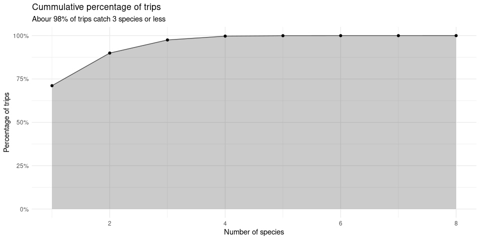

Catch - value
================

### Summary

  - Three species are sufficient to model the prices per species in
    \~98% of the trips
  - It is possible to reconstruct prices for most species from the catch
    data, but independent
  - Around 7% of records have a price (per unit weight) that is more
    than 5 times smaller or larger than the estimated average price for
    the species.
  - These records were considered outliers and not included in the catch
    and value estimation

### Plots

Before trying to calculate value for the fisheries we need to better
understand the accuracy of pricing data.

First we estimate price of different species as this will allow us to
detect which value/catch combinations might be out of whack and
shouldn’t be included in the total fisheries estimations.

One problem is that we have only value data for the whole trip, not per
species, and many trips catch more than one species. We solve that using
a multi-membership random effect model and using the catch weights of
each species as weights.

We need to determine how many species are required to characterise a
trip

``` r
drake::loadd(kobo_trips)

kobo_trips %>%
  count(trip_n_species) %>%
    filter(trip_n_species %in% 1:8) %>%
  janitor::adorn_percentages(denominator = "col") %>%
  mutate(n_cum = cumsum(n)) %>%
  ggplot(aes(x = trip_n_species, y = n)) +
  # geom_col(colour = "grey30", alpha = 0.3) +
  geom_area(aes(y = n_cum), colour = "grey30", alpha = 0.25) +
  geom_point(aes(y = n_cum)) +
  scale_y_continuous(labels = scales::label_percent()) +
  theme_minimal() +
  labs(x = "Number of species", 
       y = "Percentage of trips", 
       title = "Cummulative percentage of trips", 
       subtitle = "Abour 98% of trips catch 3 species or less")
```

<!-- -->

### Species price

Used a model with a Student-T distribution and a log link to add
robustness to the prices. It seems that the model managed to provide
reasonable estimates of fish prices, but the confidence intervals remain
large for some species. Possibly due to a higher proportion of data
entry errors/inconsistencies.

``` r
drake::loadd(peskadat_species)
drake::loadd(species_price_model)

add_fitted_draws(species_price_model,
                 newdata = expand_grid(species_code_1 = unique(species_price_model$data$species_code_1),
                                  species_code_2 = "999",
                                  species_code_other = "other",
                                  weight_1 = 1,
                                  weight_2 = 0,
                                  weight_other = 0),
                 allow_new_levels = T,
                 prediction = ".value") %>%
  left_join(peskadat_species, by = c("species_code_1" = "species_code")) %>%
  ungroup() %>%
  mutate(category = fct_reorder(category, .value)) %>%
  ggplot(aes(y = .value, x = category)) +
  stat_pointinterval(.width = c(0.66, 0.95)) +
  theme_minimal() +
  theme(axis.text.x = element_text(angle = 90)) +
  labs(title = "Estimated mean price per kilogram of aquatic foods in timor", 
       y = "US Dollars")
```

<!-- -->

``` r
drake::loadd(kobo_trips_with_price_tags)

kobo_trips_with_price_tags %>% 
  ggplot(aes(x = trip_price_residual_factor)) +
  stat_ecdf(aes(y = stat(y)), pad = F) +
  geom_vline(xintercept = c(1/5, 5), size = 0.25, linetype = 2) +
  scale_x_continuous(trans = "log10", 
                     breaks = c(0.01, 0.1, 0.2, 0.5,  1, 2,5,10, 100, 1000), 
                     labels = c("1/1--" ,"1/10", "1/5", "1/2", "1", "2", "5", "10", "100", "1000")) +
  scale_y_continuous(breaks = seq(0, 1, length.out = 11), labels = scales::percent) + 
  theme_minimal() +
  theme(panel.grid.minor.x = element_blank()) +
  labs(y = "Cummulative density distribution", 
       x = "Multiplicative difference", 
       title = "Cummulative density function of difference between recorded and estimated price", 
       subtitle = "About 93% of the recorded prices are less than 5 times larger or smaller than the estimated")
```

<!-- -->
