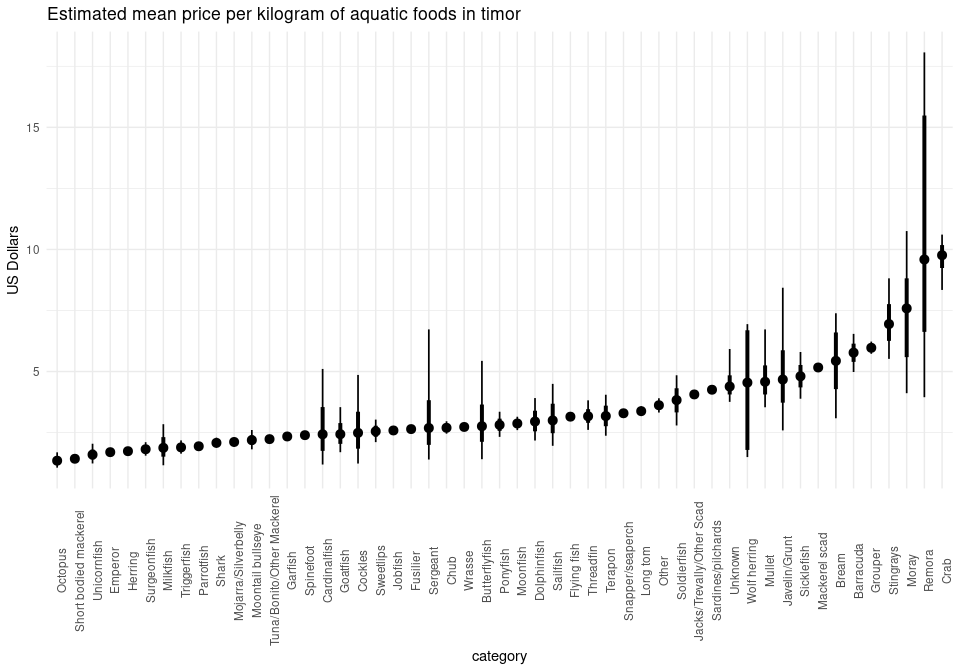
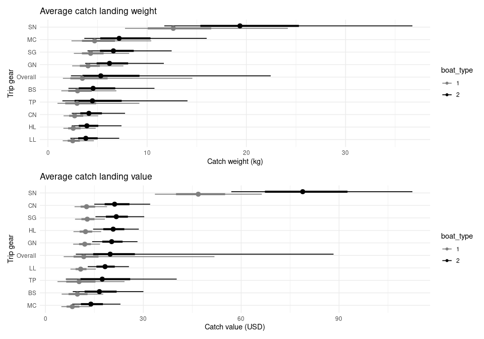
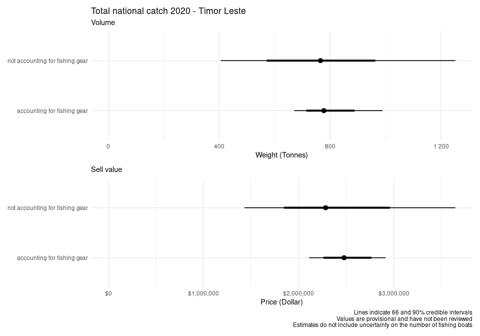
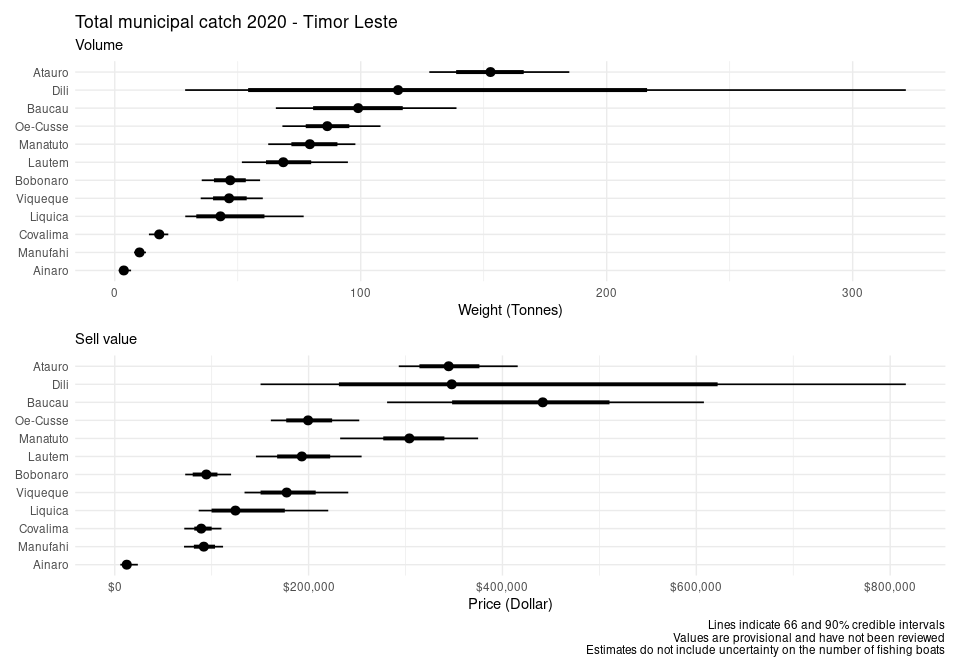

Catch - value
================

### Summary

  - Three species are sufficient to model the prices per species in
    \~98% of the trips
  - It is possible to reconstruct prices for most species from the catch
    data, but independent
  - Around 7% of records have a price (per unit weight) that is more
    than 5 times smaller or larger than the estimated average price for
    the species.
  - These records were considered outliers and not included in the catch
    and value estimation

### Plots

Before trying to calculate value for the fisheries we need to better
understand the accuracy of pricing data.

First we estimate price of different species as this will allow us to
detect which value/catch combinations might be out of whack and
shouldn’t be included in the total fisheries estimations.

One problem is that we have only value data for the whole trip, not per
species, and many trips catch more than one species. We solve that using
a multi-membership random effect model and using the catch weights of
each species as weights.

We need to determine how many species are required to characterise a
trip

``` r
drake::loadd(kobo_trips)

kobo_trips %>%
  count(trip_n_species) %>%
    filter(trip_n_species %in% 1:8) %>%
  janitor::adorn_percentages(denominator = "col") %>%
  mutate(n_cum = cumsum(n)) %>%
  ggplot(aes(x = trip_n_species, y = n)) +
  # geom_col(colour = "grey30", alpha = 0.3) +
  geom_area(aes(y = n_cum), colour = "grey30", alpha = 0.25) +
  geom_point(aes(y = n_cum)) +
  scale_y_continuous(labels = scales::label_percent()) +
  theme_minimal() +
  labs(x = "Number of species", 
       y = "Percentage of trips", 
       title = "Cummulative percentage of trips", 
       subtitle = "Abour 98% of trips catch 3 species or less")
```

<!-- -->

### Species price

Used a model with a Student-T distribution and a log link to add
robustness to the prices. It seems that the model managed to provide
reasonable estimates of fish prices, but the confidence intervals remain
large for some species. Possibly due to a higher proportion of data
entry errors/inconsistencies.

``` r
drake::loadd(peskadat_species)
drake::loadd(species_price_model)

add_fitted_draws(species_price_model,
                 newdata = expand_grid(species_code_1 = unique(species_price_model$data$species_code_1),
                                  species_code_2 = "999",
                                  species_code_other = "other",
                                  weight_1 = 1,
                                  weight_2 = 0,
                                  weight_other = 0),
                 allow_new_levels = T,
                 prediction = ".value") %>%
  left_join(peskadat_species, by = c("species_code_1" = "species_code")) %>%
  ungroup() %>%
  mutate(category = fct_reorder(category, .value)) %>%
  ggplot(aes(y = .value, x = category)) +
  stat_pointinterval(.width = c(0.66, 0.95)) +
  theme_minimal() +
  theme(axis.text.x = element_text(angle = 90)) +
  labs(title = "Estimated mean price per kilogram of aquatic foods in timor", 
       y = "US Dollars")
```

<!-- -->

``` r
drake::loadd(kobo_trips_with_price_tags)

kobo_trips_with_price_tags %>% 
  ggplot(aes(x = trip_price_residual_factor)) +
  stat_ecdf(aes(y = stat(y)), pad = F) +
  geom_vline(xintercept = c(1/5, 5), size = 0.25, linetype = 2) +
  scale_x_continuous(trans = "log10", 
                     breaks = c(0.01, 0.1, 0.2, 0.5,  1, 2,5,10, 100, 1000), 
                     labels = c("1/1--" ,"1/10", "1/5", "1/2", "1", "2", "5", "10", "100", "1000")) +
  scale_y_continuous(breaks = seq(0, 1, length.out = 11), labels = scales::percent) + 
  theme_minimal() +
  theme(panel.grid.minor.x = element_blank()) +
  labs(y = "Cummulative density distribution", 
       x = "Multiplicative difference", 
       title = "Cummulative density function of difference between recorded and estimated price", 
       subtitle = "About 93% of the recorded prices are less than 5 times larger or smaller than the estimated")
```

<!-- -->

## Trip catch

Modeling the catch and the value was pretty challenging. First the data
contains lots of extreme values and is positively bounded, and as such a
gaussian distribution is not suitable. It also is zero inflated and as
such a student distribution, that would accommodate the extreme values
is not suitable. A Zero-Inflated Poisson distribution accommodates for
the positive only values and the zero inflation but strugles with the
extreme values. A cubic root transformation of both catch and value
(based on the rationale that volume expands cubically) seems to allow a
well matching of the posterior distribution.

The two factors with the largest effect in both catch and value were
boat type and gear. Landings from motored boats tend to be larger and
more valuable than those without. Average landings from seine nets seem
to be much larger than caught using other methods. Manual collection
landings tend to be the smallest and provide least income. Despite the
importance of gear, without a way to accurately estimate the frequency
with which each gear is used as a proportion of all trips, we would have
use the overall mean to estimate annual catch and value, which will
likely introduce a great deal of uncertainty in the estimates. We will
later explore whether is possible to obtain this frequency estimate from
the survey data or whether it is appropriate to use the overall
estimation instead.

``` r
drake::loadd(catch_model)
drake::loadd(value_model)

p1 <- add_fitted_draws(expand_grid(trip_gear = c(unique(catch_model$data$trip_gear),
                                           "Overall"),
                             boat_type = unique(catch_model$data$boat_type)),
                 catch_model, 
                 re_formula = ~ (1 | trip_gear)+ (1 | boat_type), #  + (1|municipality_name), 
                 allow_new_levels = T) %>% 
  ungroup() %>%
  mutate(trip_gear = fct_reorder(trip_gear, .value)) %>%
  ggplot(aes(x = (.value^3)/1000, y = trip_gear)) +
  stat_pointinterval(aes(colour = boat_type), .width = c(0.66, 0.95), 
                     position = position_dodge(width = 0.4)) +
  # facet_w("municipality_name", scales = "free_y") +
  scale_color_manual(values = c("grey50", "black")) +
  theme_minimal() +
  # theme(legend.position = "none") +
  labs(title = "Average catch landing weight", 
       x = "Catch weight (kg)",
       y = "Trip gear") 

p2 <- add_fitted_draws(expand_grid(trip_gear = c(unique(value_model$data$trip_gear),
                                           "Overall"),
                             boat_type = unique(value_model$data$boat_type)),
                 value_model, 
                 re_formula = ~ (1 | trip_gear)+ (1 | boat_type), #  + (1|municipality_name), 
                 allow_new_levels = T) %>% 
  ungroup() %>%
  mutate(trip_gear = fct_reorder(trip_gear, .value)) %>%
  ggplot(aes(x = (.value^3)/1000, y = trip_gear)) +
  stat_pointinterval(aes(colour = boat_type), .width = c(0.66, 0.95), 
                     position = position_dodge(width = 0.4)) +
  # facet_w("municipality_name", scales = "free_y") +
  scale_color_manual(values = c("grey50", "black")) +
  theme_minimal() +
  # theme(legend.position = "none") +
  labs(title = "Average catch landing value", 
       x = "Catch value (USD)",
       y = "Trip gear") 

p1 + p2 + plot_layout(ncol = 1)
```

<!-- -->

Landing weights from different municipalities were also different. With
Lautem and Atauro landing comparatively more than other municipalities.
The landing value does not completely agrees with the weight though. For
instance landings in Manufahi seem to involve a much smaller average
catch weight per trip than other municipalities, but the value of these
trips is larger than in other municipalities. These results are to be
re-evaluated after codes from landing sites are correctly assigned to
municipalities.

``` r
p1 <- add_fitted_draws(expand_grid(trip_gear = c("GN"),
                             boat_type = "1", 
                             municipality_name = c(unique(catch_model$data$municipality_name), "Overall")),
                 catch_model, 
                 re_formula = ~ (1 | trip_gear) + (1 | boat_type) + (1 | municipality_name), 
                 allow_new_levels = T) %>% 
  ungroup() %>%
  mutate(municipality_name = fct_reorder(municipality_name, .value)) %>%
  ggplot(aes(x = (.value^3)/1000, y = municipality_name)) +
  stat_pointinterval() +
  # facet_grid("trip_gear") +
  # facet_grid(municipality_name ~ trip_gear, scales = "free_y") +
  theme_minimal() +
  labs(title = "Average catch landing weight", 
       x = "Catch weight (kg)",
       y = "Municipality", 
       caption = "Averages shown for Gill Net catches in non motor boats")


p2 <- add_fitted_draws(expand_grid(trip_gear = c("GN"),
                             boat_type = "1", 
                             municipality_name = c(unique(value_model$data$municipality_name), "Overall")),
                 value_model, 
                 re_formula = ~ (1 | trip_gear) + (1 | boat_type) + (1 | municipality_name), 
                 allow_new_levels = T) %>% 
  ungroup() %>%
  mutate(municipality_name = fct_reorder(municipality_name, .value)) %>%
  ggplot(aes(x = (.value^3)/1000, y = municipality_name)) +
  stat_pointinterval() +
  # facet_grid("trip_gear") +
  # facet_grid(municipality_name ~ trip_gear, scales = "free_y") +
  theme_minimal() +
  labs(title = "Average catch landing value", 
       x = "Catch value (USD)",
       y = "Municipality", 
       caption = "Averages shown for Gill Net catches in non motor boats")

p1 + p2 + plot_layout(ncol = 1)
```

<!-- -->

Comparatively speaking, the month of the year had smaller impact on the
catch and value although not insignificant.

``` r
p1 <- add_fitted_draws(expand_grid(trip_gear = c("GN"),
                             boat_type = "1", 
                             municipality_name = "Overall", 
                             period_static = unique(catch_model$data$period_static)),
                 catch_model, 
                 re_formula = ~ (1 | trip_gear) + (1 | boat_type) + (1 | period_static), 
                 allow_new_levels = T) %>% 
  ungroup() %>%
  mutate(period_static = lubridate::as_date(period_static)) %>%
  ggplot(aes(y = (.value^3)/1000, x = period_static)) +
  stat_lineribbon(aes(alpha = forcats::fct_rev(ordered(stat(.width)))), 
                  .width = c(0.05, 0.66, 0.95), size = 0.5, fill = "black") +
  scale_alpha_manual(values = c(0.05, 0.33, 0.95), name = "Credible interval") +
  theme_minimal() +
  labs(title = "Average catch landing weight", 
       y = "Catch weight (kg)",
       x = "Date", 
       caption = "Averages shown for Gill Net catches in non motor boats")

p2 <-add_fitted_draws(expand_grid(trip_gear = c("GN"),
                             boat_type = "1", 
                             municipality_name = "Overall", 
                             period_static = unique(value_model$data$period_static)),
                 value_model, 
                 re_formula = ~ (1 | trip_gear) + (1 | boat_type) + (1 | period_static), 
                 allow_new_levels = T) %>% 
  ungroup() %>%
  mutate(period_static = lubridate::as_date(period_static)) %>%
  ggplot(aes(y = (.value^3)/1000, x = period_static)) +
  stat_lineribbon(aes(alpha = forcats::fct_rev(ordered(stat(.width)))), 
                  .width = c(0.05, 0.66, 0.95), size = 0.5, fill = "black") +
  scale_alpha_manual(values = c(0.05, 0.33, 0.95), name = "Credible interval") +
  theme_minimal() +
  labs(title = "Average catch landing value", 
       x = "Date",
       y = "Catch value (USD)", 
       caption = "Averages shown for Gill Net catches in non motor boats")

p1 + p2 + plot_layout(ncol = 1)
```

<!-- -->

## Gear

There seem to be clear differences on gear use across municipalities,
and boat types. In general Gill Nets are more commonly used overall.
However in Covalima and Viqueque long lines appear to be the most
sampled method while Manufahi’s fishing is dominated by hand line. Also,
in Baucau, most motorised fishing is performed using a Seine Net.

Provided the data collected is a relatively unbiased reflection of the
frequency with which gears are used in a locality, this could help
increasing the accuracy of the catch volume and value estimates.

``` r
drake::loadd(trip_gear_model)

n_samples <- 100


add_fitted_draws(newdata = expand_grid(municipality_name = unique(trip_gear_model$data$municipality_name), 
                                  boat_type = unique(trip_gear_model$data$boat_type), 
                                  size = 1), 
                 model = trip_gear_model, 
                 re_formula = ~ (1 | a | municipality_name)  + (1 | c | boat_type) , 
                 n = n_samples) %>% 
  ungroup() %>%
  mutate(.category = str_remove(.category, "^tg\\."),
         .category = fct_reorder(.category, .value)) %>%
  ggplot(aes(x = .value, y = .category)) +
  stat_pointinterval(aes(colour = boat_type)) +
  facet_wrap("municipality_name") +
  theme_minimal() +
  scale_x_continuous(labels = scales::label_percent())
```

<!-- -->

## Totals

``` r
drake::loadd(peskadat_municipalities)
drake::loadd(vessel_activity_model_brms)
period_static_unit <- "month"
period_seasonal_function <- lubridate::month

n_boats <- peskadat_municipalities %>%
  select(municipality_name, canoes, motors) %>%
  pivot_longer(c(canoes, motors), names_to = "boat_type", values_to = "n") %>%
  mutate(boat_type = str_remove(boat_type, "s$")) 

wrangle_new_data <- . %>%
  mutate(
    period_seasonal = period_seasonal_function(period_static),
    n_days_month = days_in_month(period_static),
    across(c(period_static, period_seasonal), as.character)) %>%
  inner_join(n_boats) %>%
  mutate(n_days = 1,
         # n_days = n, 
         # n_days = if_else(n_days == 0, 1, n_days),
         size = 1,
         boat_type_name = boat_type, 
         boat_type = case_when(boat_type == "canoe" ~ "1",
                               boat_type == "motor" ~ "2", 
                               TRUE ~ NA_character_)) 

new_data <- 
  expand_grid(
    municipality_name = unique(peskadat_municipalities$municipality_name),
    boat_type = c("canoe", "motor"),
    period_static = seq(ymd("2017-01-01"), ymd("2020-12-31"), "month")) %>%
  wrangle_new_data()
```

    ## Joining, by = c("municipality_name", "boat_type")

``` r
fitted_boats <- map2_dfr(split(new_data, new_data$boat_type_name),
                         vessel_activity_model_brms, 
                         ~ add_fitted_draws(newdata = .x,
                         model = .y, 
                         re_formula = ~ (1 | municipality_name) + 
                           (1 | period_static) + 
                           (1 | municipality_name:period_static) + 
                           (1 | period_seasonal), 
                         n = n_samples, 
                         allow_new_levels = T)) %>%
  mutate(n_trips = n * .value * n_days_month) %>%
  group_by(municipality_name, boat_type, period_static, period_seasonal) %>%
  mutate(.draw = 1:n()) %>%
  select(- .value, - .row, - .chain, -.iteration)

fitted_weight <- add_fitted_draws(newdata = new_data, 
                 model = catch_model, 
                 re_formula = ~ (1 | municipality_name) +
                   (1 | boat_type) +
                   (1 | period_static), 
                 n = n_samples, 
                 allow_new_levels = T) %>%
  mutate(catch_weight = .value) %>%
  group_by(municipality_name, boat_type,  period_static, period_seasonal) %>%
  mutate(.draw = 1:n()) %>%
  select(- .value, - .row, - .chain, -.iteration)

fitted_value <- add_fitted_draws(newdata = new_data, 
                 model = value_model, 
                 re_formula = ~ (1 | municipality_name) +
                   (1 | boat_type) +
                   (1 | period_static), 
                 n = n_samples, 
                 allow_new_levels = T) %>%
  mutate(catch_value = .value) %>%
  group_by(municipality_name, boat_type,  period_static, period_seasonal) %>%
  mutate(.draw = 1:n()) %>%
  select(- .value, - .row, - .chain, -.iteration)

estimations_no_gear <- inner_join(fitted_boats, fitted_weight) %>%
  inner_join(fitted_value) %>%
  mutate(across(c(catch_weight, catch_value), ~(.^3)/1000),
         total_weight = n_trips * catch_weight, 
         total_value = n_trips * catch_value) %>%
  # group_by(municipality_name, boat_type, period_static, period_seasonal, .draw) %>%
  # summarise(across(c(n_trips, catch_weight, catch_value), sum)) %>%
  mutate(period_static = lubridate::ymd(period_static))
```

    ## Joining, by = c("municipality_name", "boat_type", "period_static", "period_seasonal", "n_days_month", "n", "n_days", "size", "boat_type_name", ".draw")

    ## Joining, by = c("municipality_name", "boat_type", "period_static", "period_seasonal", "n_days_month", "n", "n_days", "size", "boat_type_name", ".draw")

``` r
fitted_gear <- add_fitted_draws(newdata = new_data, 
                                model = trip_gear_model, 
                                re_formula = ~ (1 | municipality_name)  +
                                  (1 | boat_type) , 
                                n = n_samples, 
                                allow_new_levels = T) %>%
  mutate(gear_prop = .value, 
         trip_gear = str_remove(.category, "^tg\\.")) %>%
  group_by(municipality_name, boat_type,  period_static, period_seasonal, trip_gear) %>%
  mutate(.draw = 1:n()) %>%
  select(- .value, - .row, - .chain, -.iteration)

new_data_gear <- expand_grid(
    municipality_name = unique(peskadat_municipalities$municipality_name),
    boat_type = c("canoe", "motor"),
    period_static = seq(ymd("2017-01-01"), ymd("2020-12-31"), "month"), 
    trip_gear = unique(catch_model$data$trip_gear)) %>%
  wrangle_new_data()
```

    ## Joining, by = c("municipality_name", "boat_type")

``` r
fitted_weight_gear <- add_fitted_draws(newdata = new_data_gear, 
                 model = catch_model, 
                 re_formula = ~ (1 | municipality_name) +
                   (1 | boat_type) +
                   (1 | period_static) +  
                   (1 | trip_gear), 
                 n = n_samples, 
                 allow_new_levels = T) %>%
  mutate(catch_weight = .value) %>%
  group_by(municipality_name, boat_type,  period_static, period_seasonal, trip_gear) %>%
  mutate(.draw = 1:n()) %>%
  select(- .value, - .row, - .chain, -.iteration)

fitted_value_gear <- add_fitted_draws(newdata = new_data_gear, 
                 model = value_model, 
                 re_formula = ~ (1 | municipality_name) +
                   (1 | boat_type) +
                   (1 | period_static) +  
                   (1 | trip_gear), 
                 n = n_samples, 
                 allow_new_levels = T) %>%
  mutate(catch_value = .value) %>%
  group_by(municipality_name, boat_type,  period_static, period_seasonal, trip_gear) %>%
  mutate(.draw = 1:n()) %>%
  select(- .value, - .row, - .chain, -.iteration)

estimations_gear <- fitted_boats %>%
  inner_join(fitted_gear) %>% 
  mutate(n_trips = n_trips * gear_prop) %>%
  inner_join(fitted_weight_gear) %>%
  inner_join(fitted_value_gear) %>%
  mutate(across(c(catch_weight, catch_value), ~(.^3)/1000),
         total_weight = n_trips * catch_weight, 
         total_value = n_trips * catch_value) %>%
  # group_by(municipality_name, boat_type, period_static, period_seasonal, .draw) %>%
  # summarise(across(c(n_trips, catch_weight, catch_value), sum)) %>%
  mutate(period_static = lubridate::ymd(period_static))
```

    ## Joining, by = c("municipality_name", "boat_type", "period_static", "period_seasonal", "n_days_month", "n", "n_days", "size", "boat_type_name", ".draw")

    ## Joining, by = c("municipality_name", "boat_type", "period_static", "period_seasonal", "n_days_month", "n", "n_days", "size", "boat_type_name", ".draw", "trip_gear")
    ## Joining, by = c("municipality_name", "boat_type", "period_static", "period_seasonal", "n_days_month", "n", "n_days", "size", "boat_type_name", ".draw", "trip_gear")

### Using or not gear information

Here we try to get a feeling at the impact that including the estimates
of fishing gear frequency has in the estimates of total catch. The plot
shows the estimate for volume and value when taking into account the
differences in fishing gear, and when the estimates are gear agnostic,
this is the model assumes that any gear could have been used and all
gears have the same chance to be used.

We can see that when we incorporate the gear information into the
estimates, the credible intervals are much narrower and also tend to be
in the upper half of the gear agnostic estimates. This is because based
in the survey information, gill nets are most commonly used, and this
gear method produces higer than average catches.

We use gear adjusted estimates from now on, but this is pending
corroboration on the ground that surveys are a realatively unbiased
reflection of the proportion with which gears are used.

``` r
annual_2020 <- mutate(estimations_gear, est = "accounting for fishing gear") %>%
  bind_rows(mutate(estimations_no_gear, est = "not accounting for fishing gear")) %>%
  filter(period_static >= ymd("2020-01-01")) %>%
  group_by(est, .draw) %>%
  summarise(across(where(is.numeric), sum))
```

    ## `summarise()` regrouping output by 'est' (override with `.groups` argument)

``` r
p1 <- annual_2020 %>%
  ggplot(aes(x = total_weight, y = est)) +
  stat_pointinterval() +
  theme_minimal() + 
  scale_x_continuous(limits = c(0, NA), 
                     labels = scales::label_number(scale =1/1000, suffix = "")) +
  theme(axis.title.y = element_blank()) +
  labs(title = "Total national catch 2020 - Timor Leste", 
       subtitle = "Volume",
       x = "Weight (Tonnes)")

p2 <- annual_2020  %>%
  ggplot(aes(x = total_value, y = est)) +
  stat_pointinterval() +
  theme_minimal() + 
  scale_x_continuous(limits = c(0, NA), labels = scales::label_dollar()) +
  theme(axis.title.y = element_blank()) +
  labs(subtitle = "Sell value", 
       x = "Price (Dollar)", 
       caption = "Lines indicate 66 and 90% credible intervals\nValues are provisional and have not been reviewed\nEstimates do not include uncertainty on the number of fishing boats")

p1 + p2 + plot_layout(ncol = 1)
```

<!-- -->

### Across municipalities

There are marked differences across municipalities, which is expected
given the differences across them. An evident takeaway is the large
uncertainty in the estimates for Dili, and to a smaller extent for
Baucau. Sampling of both these locations is comparatively lower for
either PDS devices (from which activity coefficients are obtained) or
enumerator survey data. Nevertheless, given the large number of boats,
these locations are important contributors to the national artisanal
fisheries catch.

Improving sampling in these locations might have a disproportionate
effect in reducing the uncertainty of catch estimates.

``` r
annual_2020_municipalities <- estimations_gear %>%
  filter(period_static >= ymd("2020-01-01")) %>%
  group_by(municipality_name, .draw) %>%
  summarise(across(where(is.numeric), sum)) %>%
  ungroup()
```

    ## `summarise()` regrouping output by 'municipality_name' (override with `.groups` argument)

``` r
p1 <- annual_2020_municipalities %>%
  mutate(municipality_name = fct_reorder(municipality_name, total_weight)) %>%
  ggplot(aes(x = total_weight, y = municipality_name)) +
  stat_pointinterval(position = position_dodge(width = 0.4)) +
  scale_x_continuous(limits = c(0, NA), 
                     labels = scales::label_number(scale =1/1000, suffix = "")) +
  theme_minimal() +
  theme(axis.title.y = element_blank()) +
  labs(title = "Total municipal catch 2020 - Timor Leste", 
       subtitle = "Volume",
       x = "Weight (Tonnes)")

p2 <- annual_2020_municipalities %>%
  mutate(municipality_name = fct_reorder(municipality_name, total_weight)) %>%
  ggplot(aes(x = total_value, y = municipality_name)) +
  stat_pointinterval(position = position_dodge(width = 0.4)) +
  scale_x_continuous(limits = c(0, NA), labels = scales::label_dollar()) +
  theme_minimal() +
  theme(axis.title.y = element_blank()) +
  labs(subtitle = "Sell value", 
       x = "Price (Dollar)", 
       caption = "Lines indicate 66 and 90% credible intervals\nValues are provisional and have not been reviewed\nEstimates do not include uncertainty on the number of fishing boats")

p1 + p2 + plot_layout(ncol = 1)
```

<!-- -->

### Over time

We now look at the totals over time in a monthly basis. Estimates from
our models seem to be considerably lower than those currently produced
in the Peskas App.

It is possible to see that as data becomes progessively more scarce the
uncertainty of the estimates also increases.

``` r
across_time <- mutate(estimations_gear, est = "gear") %>%
  # filter(municipality_name != "Dili") %>%
  group_by(period_static,  .draw) %>%
  summarise(across(where(is.numeric), sum)) 
```

    ## `summarise()` regrouping output by 'period_static' (override with `.groups` argument)

``` r
p1 <- across_time%>%
  ggplot(aes(x = period_static, y = total_weight)) +
  stat_lineribbon(aes(alpha = forcats::fct_rev(ordered(stat(.width)))), 
                  .width = c(0.05, 0.66, 0.90), size = 0.5, fill = "black") +
  scale_alpha_manual(values = c(0.05, 0.33, 0.90), name = "Credible interval") +
  theme_minimal() + 
  scale_y_continuous(limits = c(0, NA), labels = scales::label_number(scale =1/1000, suffix = "")) + 
  theme(axis.title.x = element_blank(), 
        legend.position = "none") +
  labs(title = "Total national catch monthly - Timor Leste", 
       subtitle = "Volume",
       y = "Weight  (Tonnes)")

p2 <- across_time %>%
  ggplot(aes(x = period_static, y = total_value,)) +
  stat_lineribbon(aes(alpha = forcats::fct_rev(ordered(stat(.width)))), 
                  .width = c(0.05, 0.66, 0.90), size = 0.5, fill = "black") +
  scale_alpha_manual(values = c(0.05, 0.33, 0.90), name = "Credible interval") +
  theme_minimal() + 
  scale_y_continuous(limits = c(0, NA), labels = scales::label_dollar()) +
  theme(axis.title.x = element_blank(), 
        legend.position = "none") +
  labs(subtitle = "Sell value",
       y = "Price (Dollar)",
       caption = "Shaded areas indicate 66 and 90% credible intervals\nValues are provisional and have not been reviewed\nEstimates do not include uncertainty on the number of fishing boats")

p1 + p2 + plot_layout(ncol = 1)
```

<!-- -->
