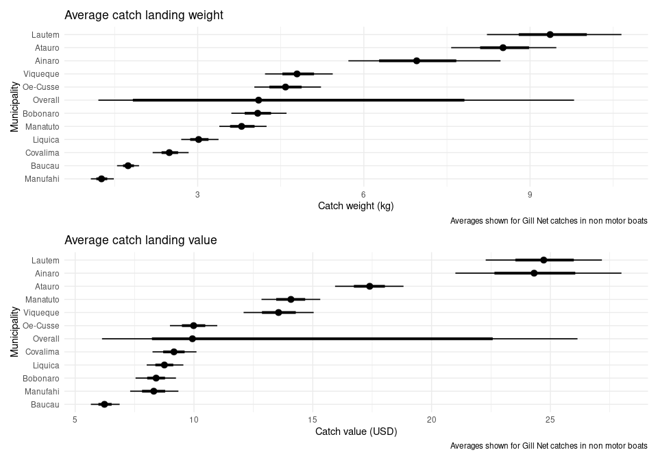
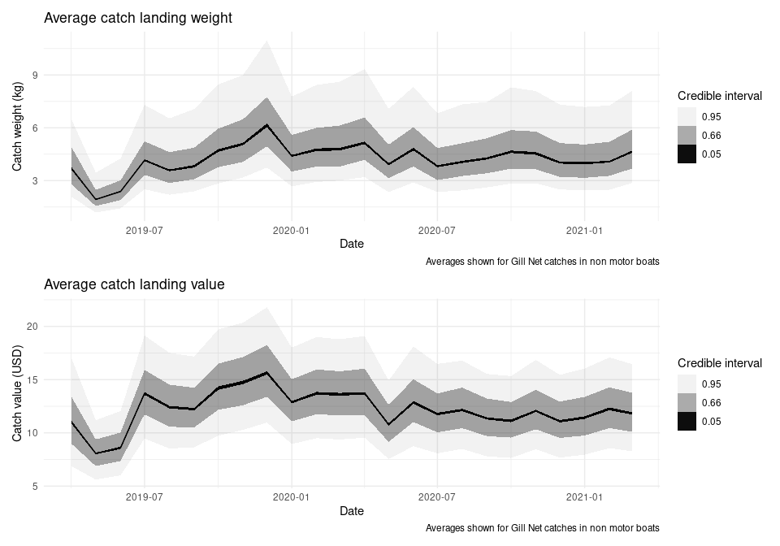

Catch - value
================

### Summary

  - Three species are sufficient to model the prices per species in
    \~98% of the trips
  - It is possible to reconstruct prices for most species from the catch
    data, but independent
  - Around 7% of records have a price (per unit weight) that is more
    than 5 times smaller or larger than the estimated average price for
    the species.
  - These records were considered outliers and not included in the catch
    and value estimation

### Plots

Before trying to calculate value for the fisheries we need to better
understand the accuracy of pricing data.

First we estimate price of different species as this will allow us to
detect which value/catch combinations might be out of whack and
shouldn’t be included in the total fisheries estimations.

One problem is that we have only value data for the whole trip, not per
species, and many trips catch more than one species. We solve that using
a multi-membership random effect model and using the catch weights of
each species as weights.

We need to determine how many species are required to characterise a
trip

``` r
drake::loadd(kobo_trips)

kobo_trips %>%
  count(trip_n_species) %>%
    filter(trip_n_species %in% 1:8) %>%
  janitor::adorn_percentages(denominator = "col") %>%
  mutate(n_cum = cumsum(n)) %>%
  ggplot(aes(x = trip_n_species, y = n)) +
  # geom_col(colour = "grey30", alpha = 0.3) +
  geom_area(aes(y = n_cum), colour = "grey30", alpha = 0.25) +
  geom_point(aes(y = n_cum)) +
  scale_y_continuous(labels = scales::label_percent()) +
  theme_minimal() +
  labs(x = "Number of species", 
       y = "Percentage of trips", 
       title = "Cummulative percentage of trips", 
       subtitle = "Abour 98% of trips catch 3 species or less")
```

<!-- -->

### Species price

Used a model with a Student-T distribution and a log link to add
robustness to the prices. It seems that the model managed to provide
reasonable estimates of fish prices, but the confidence intervals remain
large for some species. Possibly due to a higher proportion of data
entry errors/inconsistencies.

``` r
drake::loadd(peskadat_species)
drake::loadd(species_price_model)

add_fitted_draws(species_price_model,
                 newdata = expand_grid(species_code_1 = unique(species_price_model$data$species_code_1),
                                  species_code_2 = "999",
                                  species_code_other = "other",
                                  weight_1 = 1,
                                  weight_2 = 0,
                                  weight_other = 0),
                 allow_new_levels = T,
                 prediction = ".value") %>%
  left_join(peskadat_species, by = c("species_code_1" = "species_code")) %>%
  ungroup() %>%
  mutate(category = fct_reorder(category, .value)) %>%
  ggplot(aes(y = .value, x = category)) +
  stat_pointinterval(.width = c(0.66, 0.95)) +
  theme_minimal() +
  theme(axis.text.x = element_text(angle = 90)) +
  labs(title = "Estimated mean price per kilogram of aquatic foods in timor", 
       y = "US Dollars")
```

<!-- -->

``` r
drake::loadd(kobo_trips_with_price_tags)

kobo_trips_with_price_tags %>% 
  ggplot(aes(x = trip_price_residual_factor)) +
  stat_ecdf(aes(y = stat(y)), pad = F) +
  geom_vline(xintercept = c(1/5, 5), size = 0.25, linetype = 2) +
  scale_x_continuous(trans = "log10", 
                     breaks = c(0.01, 0.1, 0.2, 0.5,  1, 2,5,10, 100, 1000), 
                     labels = c("1/1--" ,"1/10", "1/5", "1/2", "1", "2", "5", "10", "100", "1000")) +
  scale_y_continuous(breaks = seq(0, 1, length.out = 11), labels = scales::percent) + 
  theme_minimal() +
  theme(panel.grid.minor.x = element_blank()) +
  labs(y = "Cummulative density distribution", 
       x = "Multiplicative difference", 
       title = "Cummulative density function of difference between recorded and estimated price", 
       subtitle = "About 93% of the recorded prices are less than 5 times larger or smaller than the estimated")
```

<!-- -->

## Trip catch

Modeling the catch and the value was pretty challenging. First the data
contains lots of extreme values and is positively bounded, and as such a
gaussian distribution is not suitable. It also is zero inflated and as
such a student distribution, that would accommodate the extreme values
is not suitable. A Zero-Inflated Poisson distribution accommodates for
the positive only values and the zero inflation but strugles with the
extreme values. A cubic root transformation of both catch and value
(based on the rationale that volume expands cubically) seems to allow a
well matching of the posterior distribution.

The two factors with the largest effect in both catch and value were
boat type and gear. Landings from motored boats tend to be larger and
more valuable than those without. Average landings from seine nets seem
to be much larger than caught using other methods. Manual collection
landings tend to be the smallest and provide least income. Despite the
importance of gear, without a way to accurately estimate the frequency
with which each gear is used as a proportion of all trips, we would have
use the overall mean to estimate annual catch and value, which will
likely introduce a great deal of uncertainty in the estimates. We will
later explore whether is possible to obtain this frequency estimate from
the survey data or whether it is appropriate to use the overall
estimation instead.

``` r
drake::loadd(catch_model)
drake::loadd(value_model)

p1 <- add_fitted_draws(expand_grid(trip_gear = c(unique(catch_model$data$trip_gear),
                                           "Overall"),
                             boat_type = unique(catch_model$data$boat_type)),
                 catch_model, 
                 re_formula = ~ (1 | trip_gear)+ (1 | boat_type), #  + (1|municipality_name), 
                 allow_new_levels = T) %>% 
  ungroup() %>%
  mutate(trip_gear = fct_reorder(trip_gear, .value)) %>%
  ggplot(aes(x = (.value^3)/1000, y = trip_gear)) +
  stat_pointinterval(aes(colour = boat_type), .width = c(0.66, 0.95), 
                     position = position_dodge(width = 0.4)) +
  # facet_w("municipality_name", scales = "free_y") +
  scale_color_manual(values = c("grey50", "black")) +
  theme_minimal() +
  # theme(legend.position = "none") +
  labs(title = "Average catch landing weight", 
       x = "Catch weight (kg)",
       y = "Trip gear") 

p2 <- add_fitted_draws(expand_grid(trip_gear = c(unique(value_model$data$trip_gear),
                                           "Overall"),
                             boat_type = unique(value_model$data$boat_type)),
                 value_model, 
                 re_formula = ~ (1 | trip_gear)+ (1 | boat_type), #  + (1|municipality_name), 
                 allow_new_levels = T) %>% 
  ungroup() %>%
  mutate(trip_gear = fct_reorder(trip_gear, .value)) %>%
  ggplot(aes(x = (.value^3)/1000, y = trip_gear)) +
  stat_pointinterval(aes(colour = boat_type), .width = c(0.66, 0.95), 
                     position = position_dodge(width = 0.4)) +
  # facet_w("municipality_name", scales = "free_y") +
  scale_color_manual(values = c("grey50", "black")) +
  theme_minimal() +
  # theme(legend.position = "none") +
  labs(title = "Average catch landing value", 
       x = "Catch value (USD)",
       y = "Trip gear") 

p1 + p2 + plot_layout(ncol = 1)
```

<!-- -->

Landing weights from different municipalities were also different. With
Lautem and Atauro landing comparatively more than other municipalities.
The landing value does not completely agrees with the weight though. For
instance landings in Manufahi seem to involve a much smaller average
catch weight per trip than other municipalities, but the value of these
trips is larger than in other municipalities. These results are to be
re-evaluated after codes from landing sites are correctly assigned to
municipalities.

``` r
p1 <- add_fitted_draws(expand_grid(trip_gear = c("GN"),
                             boat_type = "1", 
                             municipality_name = c(unique(catch_model$data$municipality_name), "Overall")),
                 catch_model, 
                 re_formula = ~ (1 | trip_gear) + (1 | boat_type) + (1 | municipality_name), 
                 allow_new_levels = T) %>% 
  ungroup() %>%
  mutate(municipality_name = fct_reorder(municipality_name, .value)) %>%
  ggplot(aes(x = (.value^3)/1000, y = municipality_name)) +
  stat_pointinterval() +
  # facet_grid("trip_gear") +
  # facet_grid(municipality_name ~ trip_gear, scales = "free_y") +
  theme_minimal() +
  labs(title = "Average catch landing weight", 
       x = "Catch weight (kg)",
       y = "Municipality", 
       caption = "Averages shown for Gill Net catches in non motor boats")


p2 <- add_fitted_draws(expand_grid(trip_gear = c("GN"),
                             boat_type = "1", 
                             municipality_name = c(unique(value_model$data$municipality_name), "Overall")),
                 value_model, 
                 re_formula = ~ (1 | trip_gear) + (1 | boat_type) + (1 | municipality_name), 
                 allow_new_levels = T) %>% 
  ungroup() %>%
  mutate(municipality_name = fct_reorder(municipality_name, .value)) %>%
  ggplot(aes(x = (.value^3)/1000, y = municipality_name)) +
  stat_pointinterval() +
  # facet_grid("trip_gear") +
  # facet_grid(municipality_name ~ trip_gear, scales = "free_y") +
  theme_minimal() +
  labs(title = "Average catch landing value", 
       x = "Catch value (USD)",
       y = "Municipality", 
       caption = "Averages shown for Gill Net catches in non motor boats")

p1 + p2 + plot_layout(ncol = 1)
```

<!-- -->

Comparatively speaking, the month of the year had smaller impact on the
catch and value although not insignificant.

``` r
p1 <- add_fitted_draws(expand_grid(trip_gear = c("GN"),
                             boat_type = "1", 
                             municipality_name = "Overall", 
                             period_static = unique(catch_model$data$period_static)),
                 catch_model, 
                 re_formula = ~ (1 | trip_gear) + (1 | boat_type) + (1 | period_static), 
                 allow_new_levels = T) %>% 
  ungroup() %>%
  mutate(period_static = lubridate::as_date(period_static)) %>%
  ggplot(aes(y = (.value^3)/1000, x = period_static)) +
  stat_lineribbon(aes(alpha = forcats::fct_rev(ordered(stat(.width)))), 
                  .width = c(0.05, 0.66, 0.95), size = 0.5, fill = "black") +
  scale_alpha_manual(values = c(0.05, 0.33, 0.95), name = "Credible interval") +
  theme_minimal() +
  labs(title = "Average catch landing weight", 
       y = "Catch weight (kg)",
       x = "Date", 
       caption = "Averages shown for Gill Net catches in non motor boats")

p2 <-add_fitted_draws(expand_grid(trip_gear = c("GN"),
                             boat_type = "1", 
                             municipality_name = "Overall", 
                             period_static = unique(value_model$data$period_static)),
                 value_model, 
                 re_formula = ~ (1 | trip_gear) + (1 | boat_type) + (1 | period_static), 
                 allow_new_levels = T) %>% 
  ungroup() %>%
  mutate(period_static = lubridate::as_date(period_static)) %>%
  ggplot(aes(y = (.value^3)/1000, x = period_static)) +
  stat_lineribbon(aes(alpha = forcats::fct_rev(ordered(stat(.width)))), 
                  .width = c(0.05, 0.66, 0.95), size = 0.5, fill = "black") +
  scale_alpha_manual(values = c(0.05, 0.33, 0.95), name = "Credible interval") +
  theme_minimal() +
  labs(title = "Average catch landing value", 
       x = "Date",
       y = "Catch value (USD)", 
       caption = "Averages shown for Gill Net catches in non motor boats")

p1 + p2 + plot_layout(ncol = 1)
```

<!-- -->
