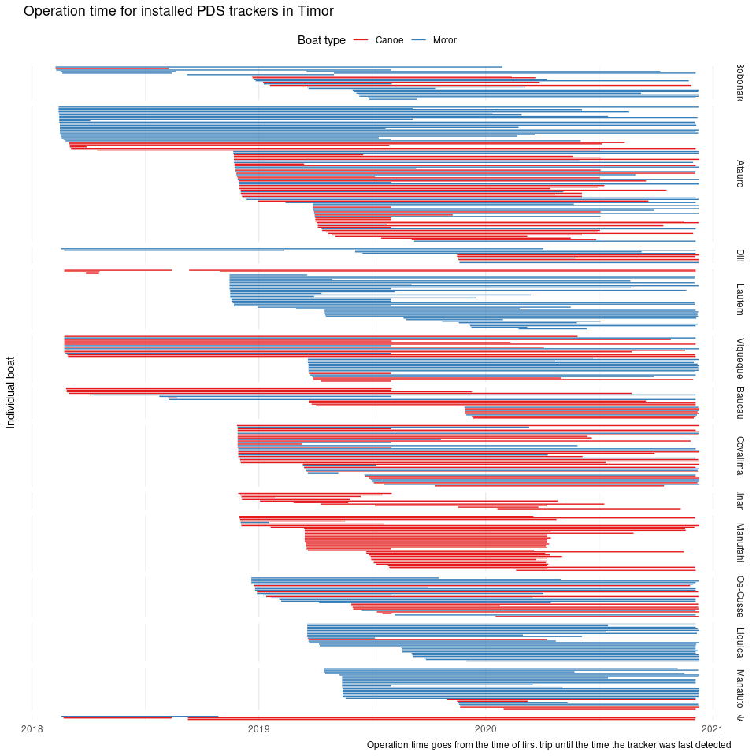
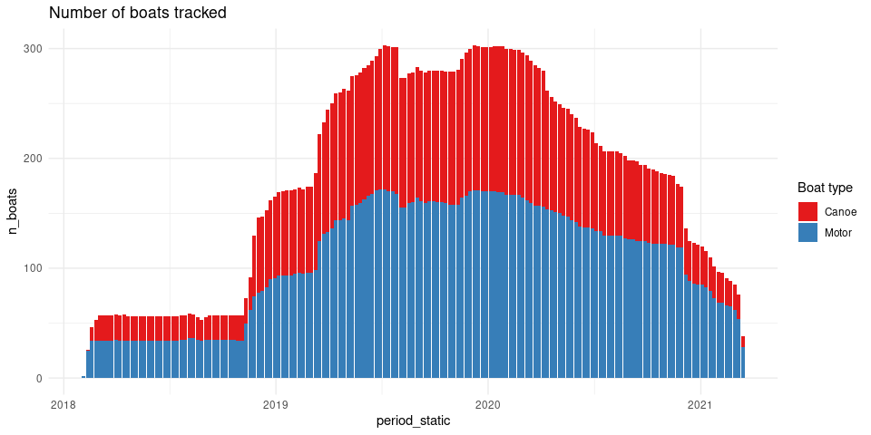

Vessel activity
================

Here we look, on a high level, at the tracks data used to determine
vessel activity. As well as the results from the vessel activity
coefficient modelling.

## Summary

  - Sampling is currently insufficient to reliable report activity
    estimates at the municipality level, but is to-date enough to paint
    a picture at the national level with certain confidence.
  - Canoe boats are under-represented from tracking. About 40% of
    trackers devices have been installed in canoes, but they constitute
    about 70% of the fishing fleet. The disparity is larger in some
    municipalities.
  - The number of operational tracking units is steadily declining.
    Sampling in some locations for at least one boat type is already
    nil. At the current rate, the ability to generate activity estimates
    at the national level might be severely compromised in 1 to 2 years
    time.
  - There are large gaps in data availability in tracking data. The
    origin of this gaps is unknown and calls to question the reliability
    of the service.
  - Significant number of boat trackers stop being operational
    simultaneously particularly at the beginning of the first quarter
    2019 and the beginning of the second quarter 2020. The reason for
    this decline is currently unknown.

<!-- end list -->

``` r
drake::loadd(vessel_activity_bernoulli)

vessel_activity_bernoulli %>%
  group_by(imei, boat_id_pds, boat_code, municipality_name) %>%
  summarise(installation = min(trip_end_date_pds), 
            last_heard = max(trip_end_date_pds), .groups = "drop") %>%
  mutate(boat_id_pds = fct_reorder(boat_id_pds, installation, .fun = min, .desc = T),
         municipality_name = fct_reorder(municipality_name, installation, .fun = min, .desc = F)) %>%
  ggplot(aes(y = boat_id_pds, colour = boat_code)) +
  geom_segment(aes(x = installation, xend = last_heard, yend = boat_id_pds)) +
  facet_grid(municipality_name ~ ., scales = "free", space = "free", margins = F) +
  scale_color_brewer(palette = "Pastel1", labels = c("Canoe", "Motor"), name = "Boat type") +
  theme_minimal() +
  theme(axis.text.y = element_blank(), 
        panel.grid.major.y = element_blank(), 
        legend.position = "top", 
        axis.title.x = element_blank()) +
  labs(title = "Operation time for installed PDS trackers in Timor", 
       caption = "Operation time goes from the time of first trip until the time the tracker was last detected",
       legend = "Boat type",
       y = "Individual boat")
```

<!-- -->

``` r
vessel_activity_bernoulli %>%
  complete(period_static, boat_code) %>%
  group_by(period_static, boat_code) %>%
  summarise(n_boats = n_distinct(boat_id_pds, na.rm = T), .groups = "drop") %>%
  mutate(boat_code = fct_reorder(boat_code, n_boats)) %>%
  ggplot(aes(x = period_static, y = n_boats, fill = boat_code)) +
  geom_col() +
  theme_minimal() +
  scale_fill_brewer(palette = "Pastel1", labels = c("Canoe", "Motor"), name = "Boat type") +
  labs(title = "Number of boats tracked")
```

<!-- -->

``` r
drake::loadd(peskadat_municipalities)

census <- peskadat_municipalities %>%
  select(-fishers) %>%
  pivot_longer(c(canoes, motors), "boat_code") %>%
  mutate(boat_code = case_when(boat_code == "canoes" ~ "1", 
                               boat_code == "motors" ~ "2"))

boats_location_data <-vessel_activity_bernoulli %>%
  complete(municipality_name, period_static, boat_code) %>%
  group_by(municipality_name, period_static, boat_code) %>%
  summarise(n_boats = n_distinct(boat_id_pds, na.rm = T), .groups = "drop") %>%
  left_join(census, by = c("municipality_name", "boat_code")) %>%
  mutate(prop_boats = n_boats / value, 
         municipality_name = fct_reorder(municipality_name, n_boats,.fun = max, .desc = T))

proportion_plot <- boats_location_data %>%
  ggplot(aes(x = period_static, y = prop_boats, colour = boat_code)) +
  geom_step() +
  scale_y_continuous(labels = scales::percent) +
  facet_wrap("municipality_name", ncol = 1, scales = "free") +
  scale_colour_brewer(palette = "Pastel1", labels = c("Canoe", "Motor"), name = "Boat type") +
  theme_minimal() +
  theme(legend.position = "bottom") +
  labs(title = "Proportion of boats tracked")

count_plot <- boats_location_data %>%
  ggplot(aes(x = period_static, y = n_boats, fill = boat_code)) +
  geom_col() +
  facet_wrap("municipality_name", ncol = 1, scales = "free") +
  scale_fill_brewer(palette = "Pastel1", labels = c("Canoe", "Motor"), name = "Boat type") +
  theme_minimal() +
  theme(legend.position = "bottom") +
  labs(title = "Number of boats tracked")

cowplot::plot_grid(count_plot, proportion_plot, ncol = 2)
```

<!-- -->
We compare models in the Bernoulli formulation because it offers more
flexibility. As this option (as opposed to a Binomial formulation) allow
us to explicitly set day covariates in case it’s needed.

First we determine the time binning that’s most appropriate for the
data.

``` r
datasets <- list(
 weekly = get_bernoulli_data("week", lubridate::week), 
 monthly = get_bernoulli_data("month", lubridate::month),
 quarterly = get_bernoulli_data("quarterly", lubridate::quarter)
)

boat_type <- list(canoe = 1, 
                  powerboat = 2)

models <- cross2(datasets, boat_type) %>%
  map(~ filter(.[[1]], boat_code == .[[2]])) %>%
  map(~ glmer(trip_activity ~  
                (1 | municipality_name) +
                (1 | wday) + 
                (1 | period_static) +
                (1 | municipality_name : period_static) +
                (1 | period_seasonal) +
                (1 | individual_boat), 
              data = ., 
              family = "binomial"))

AIC(models[[1]], models[[2]], models[[3]])
AIC(models[[4]], models[[5]], models[[6]])

summary(models[[1]])
summary(models[[4]])
```

Looks like weekly is better…

Second we look at whether week day is worth keeping as the standard
deviation of this random effect is relatively small.

``` r
models_no_wday <- cross2(datasets[1], boat_type) %>%
  map(~ filter(.[[1]], boat_code == .[[2]])) %>%
  map(~ glmer(trip_activity ~  
                (1 | municipality_name) +
                (1 | period_static) +
                (1 | municipality_name : period_static) +
                (1 | period_seasonal) +
                (1 | individual_boat), 
              data = ., 
              family = "binomial"))

AIC(models[[1]], models_no_wday[[1]])
AIC(models[[4]], models_no_wday[[2]])
```

Does seem to be useful

``` r
cross2(datasets[1], boat_type) %>%
  map(~ filter(.[[1]], boat_code == .[[2]])) %>%
  map(~ select(., boat_code, municipality_name, period_static, period_seasonal) %>% distinct()) %>%
  map2_dfr(models[c(1,4)], function(x,y) {
    est <- predict(y,
                   newdata = x,
                   re.form = ~
                     (1 | municipality_name) +
                     (1 | period_static) +
                     (1 | municipality_name : period_static) +
                     (1 | period_seasonal),
                   allow.new.levels = T)
    x %>%
      mutate(estimate = est)
    }) %>%
  complete(boat_code, municipality_name, period_static = full_seq(period_static, 7)) %>%
  ggplot(aes(x = period_static, y = plogis(estimate))) +
  geom_path(aes(colour = boat_code), na.rm = F) +
  # scale_y_continuous(trans = scales::logit_trans()) +
  facet_wrap(~ municipality_name)
```

``` r
datasets$weekly %>%
  group_by(imei, boat_id_pds, boat_code, municipality_name) %>%
  summarise(installation = min(trip_end_date_pds), 
            last_heard = max(trip_end_date_pds), .groups = "drop") %>%
  mutate(boat_id_pds = fct_reorder(boat_id_pds, installation, .fun = min, .desc = T),
         municipality_name = fct_reorder(municipality_name, installation, .fun = min, .desc = F)) %>%
  ggplot(aes(y = boat_id_pds, colour = boat_code)) +
  geom_segment(aes(x = installation, xend = last_heard, yend = boat_id_pds)) +
  facet_grid(municipality_name ~ ., scales = "free", space = "free")
```
